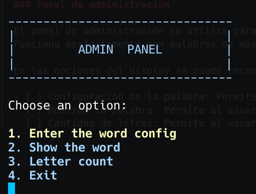
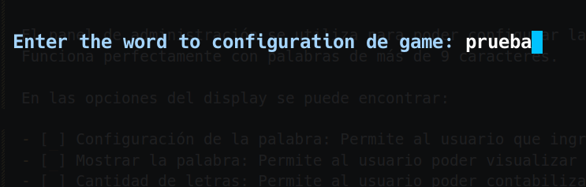
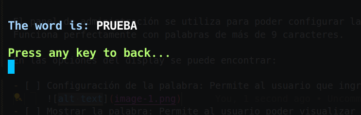
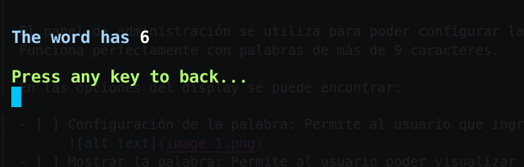
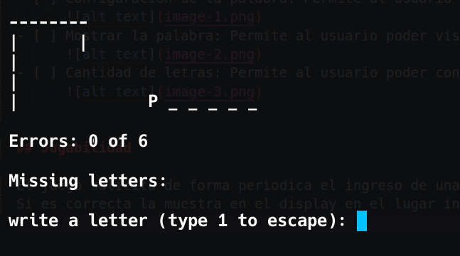
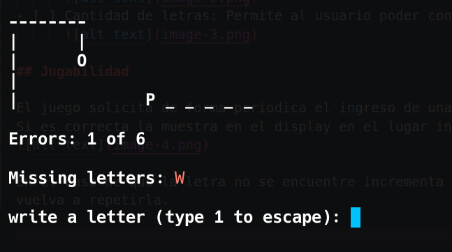
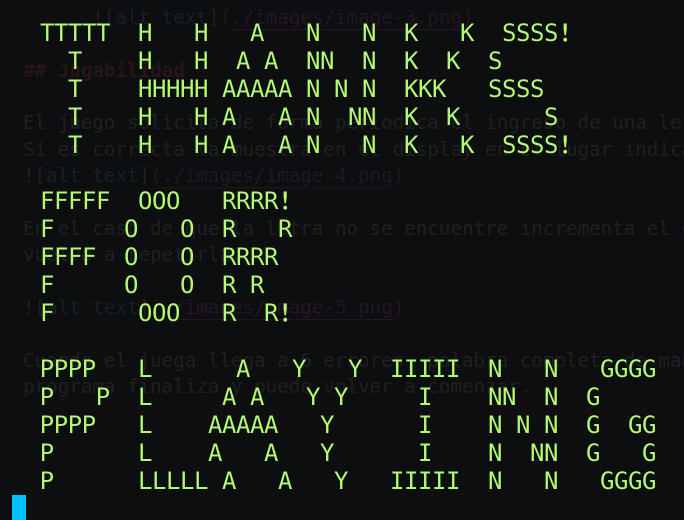

# HANGMAN GAME

#### Juego del ahorcado desarrollado en el lenguaje Pascal.

## Requisitos

- [ ] Compilador de pascal: puede ser fpc (free pascal compiler) o cualquier otro.

## Instalación

- [ ] Clonar o descargar el repositorio.
- [ ] Compilar el archivo main.pas con su compilador de preferencia, (en este caso se compila con free pascal compiler / fpc).
- [ ] Ejecutar el archivo main.exe

```env
Nota: Si se encuentra en otro sistema operativo diferente de windows puede compilar y ejecutar el programa main directamente en la terminal
```

## Configuración

### Panel de administración

El panel de administración se utiliza para poder configurar la palabra a adivinar del juego.
Funciona perfectamente con palabras de más de 9 caracteres.

En las opciones del display se puede encontrar:


- [ ] Configuración de la palabra: Permite al usuario que ingrese la palabra a adivinar en el juego.
      
- [ ] Mostrar la palabra: Permite al usuario poder visualizar la palabra ingresada en el paso anterior para verificarla.
      
- [ ] Cantidad de letras: Permite al usuario poder contabilizar la cantidad de caracteres que posee la palabra ingresada.
      

## Jugabilidad

El juego solicita de forma periodica el ingreso de una letra para poder evaluarla en el juego.
Si es correcta la muestra en el display en el lugar indicado.


En el caso de que la letra no se encuentre incrementa el contador de errores y muestra la letra para que el usuario no vuelva a repetirla.



Cuando el juega llega a 6 errores, palabra completa de manera correcta o se corte la ejecución al ingresar un 1, el programa finaliza y puede volver a comenzar.


